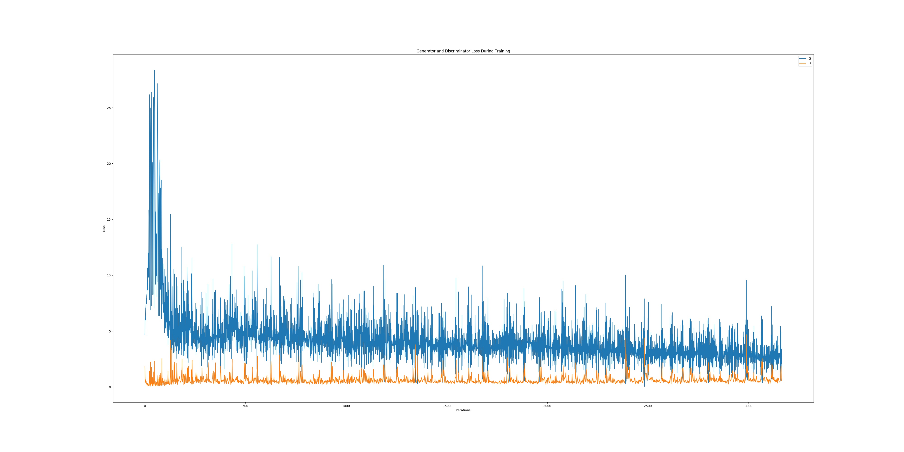
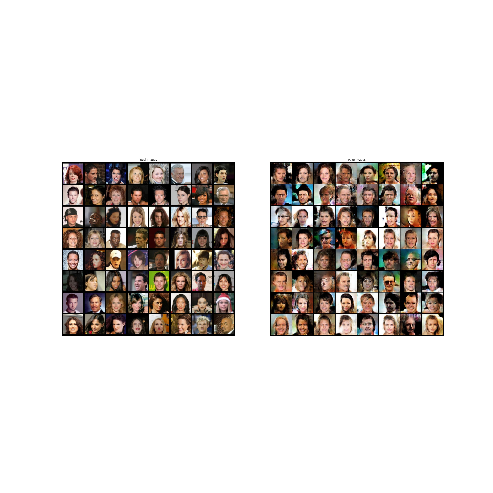
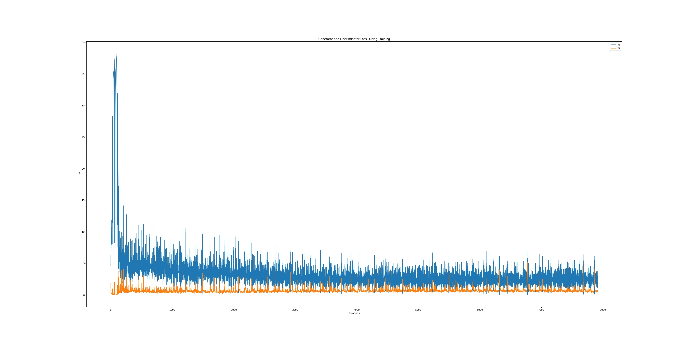
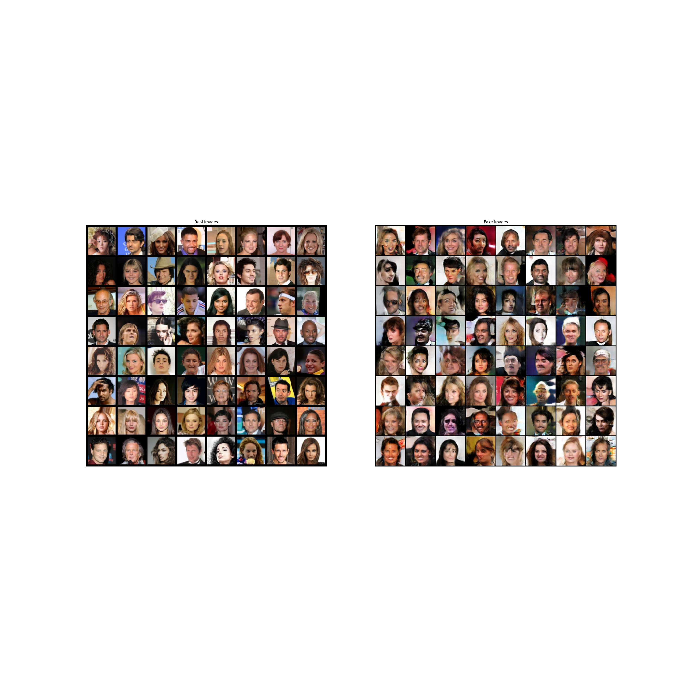
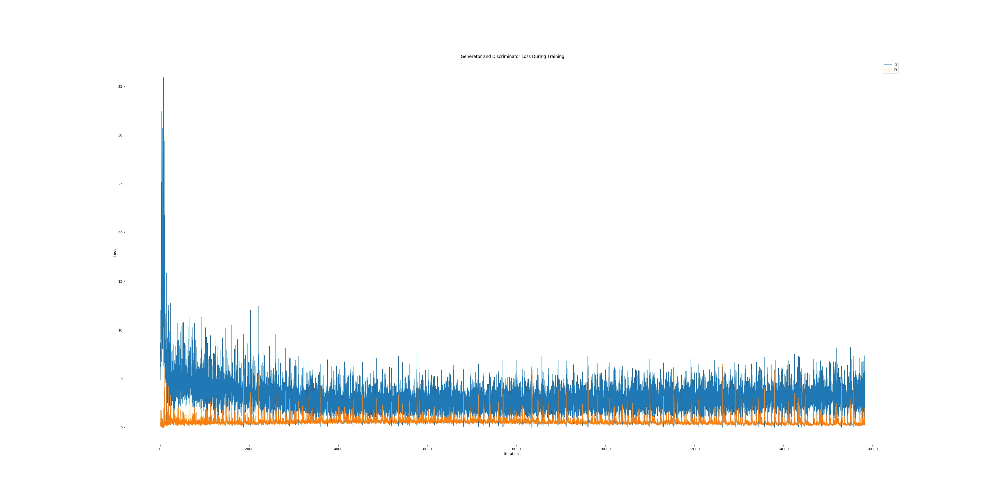
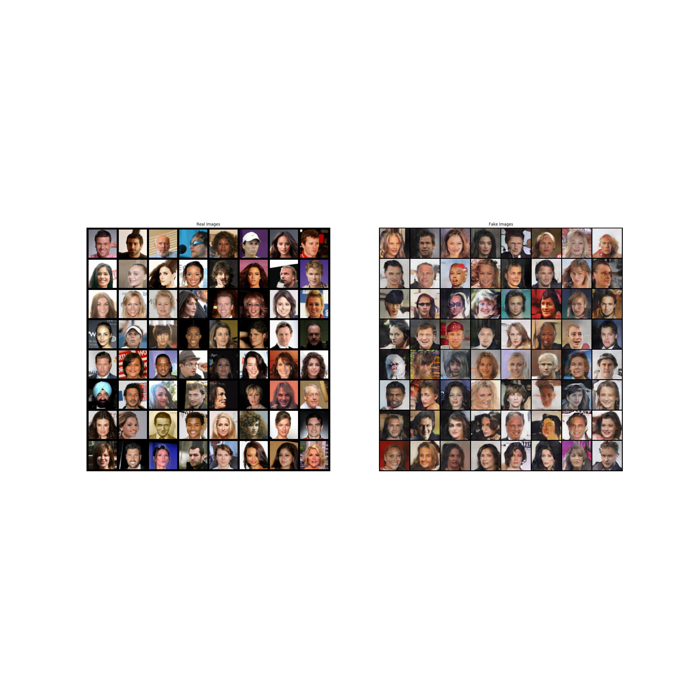
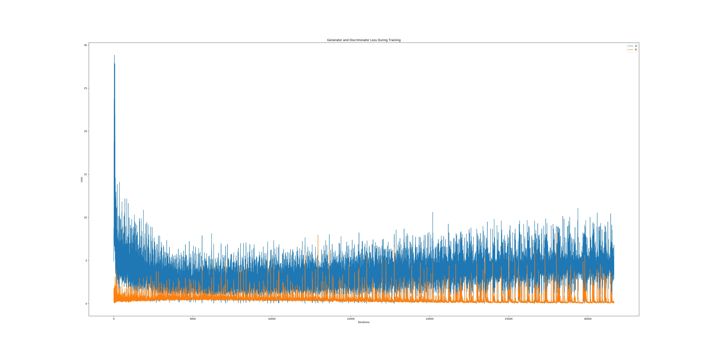
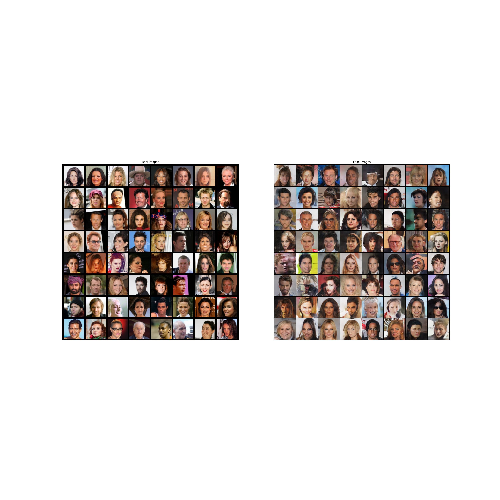
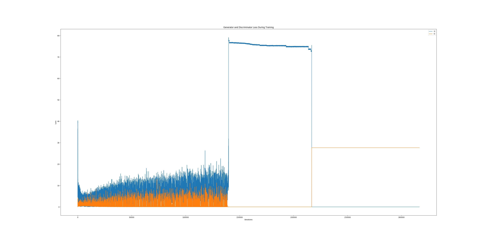
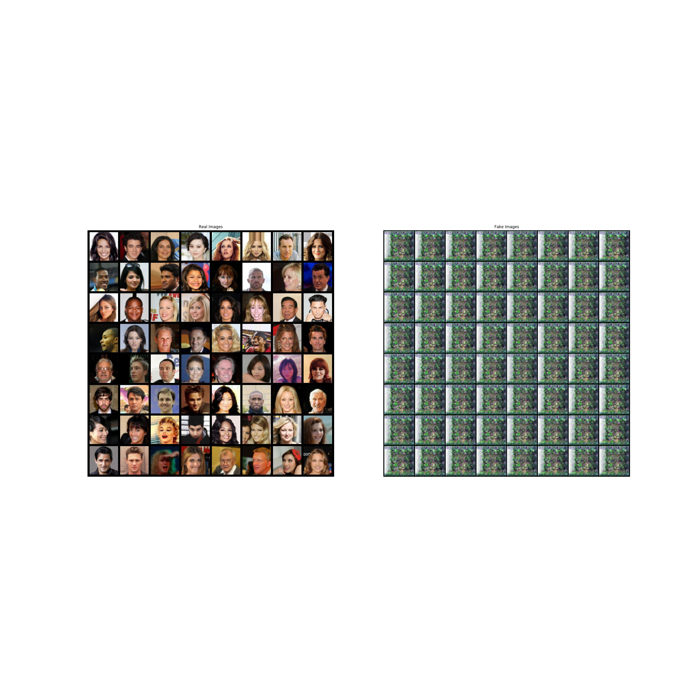

# GAN

 GANs were invented by Ian Goodfellow in 2014 and first described in the paper  
 Generative Adversarial Nets <https://papers.nips.cc/paper/5423-generative-adversarial-nets.pdf>  

# DCGAN

Unsupervised Representation Learning With Deep Convolutional Generative Adversarial Networks  
It was first described by Radford et. al. in the paper
<https://arxiv.org/pdf/1511.06434.pdf>.


# others

some of the best practies shown in ganhacks  
<https://github.com/soumith/ganhacks>  
some awesome applications about gans  
<https://github.com/nashory/gans-awesome-applications>  

# dataset
 we will use the Celeb-A Faces dataset which can be downloaded at the linked site,  
 paper: Deep Learning Face Attributes in the Wild  
 dataset web <http://mmlab.ie.cuhk.edu.hk/projects/CelebA.html>  
 Download link:  
 Baidu Drive  <https://pan.baidu.com/s/1eSNpdRG#list/path=%2F>  
 Google Drive <https://drive.google.com/drive/folders/0B7EVK8r0v71pTUZsaXdaSnZBZzg>  

The dataset will download as a file named *img_align_celeba.zip*.  
Once downloaded, create a directory named *celeba* and extract the zip file into that directory.  
Then, set the *dataroot* input for this notebook to the *celeba* directory you just created.  
The resulting directory structure should be:  

 
    /path/to/celeba
        -> img_align_celeba  
            -> 188242.jpg
            -> 173822.jpg
            -> 284702.jpg
            -> 537394.jpg
               ...
 

This is an important step because we will be using the ImageFolder dataset class,  
which requires there to be subdirectories in the dataset’s root folder.  
Now, we can create the dataset, create the dataloader,  
set the device to run on, and finally visualize some of the training data.  

how to run a test?  

```shell
bash run.sh
```

It could work.  


In priciple,the GAN optimization game is simple,the gibberish is typical  
for a generator trained without proper care! gan is hard to train. such as:  
Tried the resize code for 128x128 and finding that the Discriminator flatlines to 0.0000  
A couple of tricks are necessary for to facilitate training.  
Here is a blog:
<http://torch.ch/blog/2015/11/13/gan.html#balancing-the-gan-game>  

2 epoch output  

Loss_G and Loss_D  



real and fake images compare  



5 epoch output  

Loss_G and Loss_D  



real and fake images compare  



10 epoch output  

Loss_G and Loss_D  



real and fake images compare  



20 epoch output  

Loss_G and Loss_D  



real and fake images compare  



200 epoch output  

Loss_G and Loss_D  



real and fake images compare  


